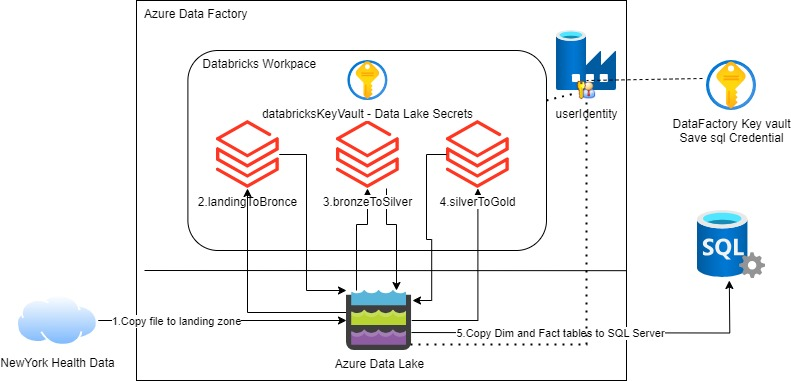
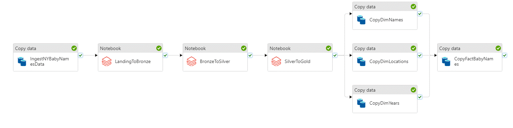

# Contoso's Data Processing Journey: A Project Setup Guide

Welcome to the project setup guide for Contoso's data processing pipeline. This guide will walk you through the steps needed to set up a simple, yet effective, data processing pipeline. The example is simple from a data point of view, but it's designed to help you learn about the technology and how to build the pipeline.

## Prerequisites

Before we embark on this adventure, ensure you have the following tools ready:

- **An Azure subscription**  [free account](https://azure.microsoft.com/free)
- **Azure CLI**: Version 2.60.0 or higher. Install from [Azure CLI's official page](https://learn.microsoft.com/cli/azure/install-azure-cli%29).
- **Bash or WSL**: A Bash-compatible shell environment is crucial. If you're on Windows, check out [Windows Subsystem for Linux (WSL)](https://learn.microsoft.com/windows/wsl/install%29).
- **Databricks CLI**: Optional, but recommended for cluster manipulation. Install instructions are available [here](https://learn.microsoft.com/azure/databricks/dev-tools/cli/tutorial%29), version 0.219.0 or higher.

## The Contoso Data Pipeline Adventure

### Step 1: Azure Login

Our journey begins with logging into Azure. Use the command below:

```bash
az login
# Optionally, set the default subscription:
# az account set --subscription <subscription_id>
```

### Step 2: Environment Setup

Like any good adventure, we need to prepare our environment:

```bash
export LOCATION=<your chosen location>
export RESOURCEGROUP_BASE_NAME=<your resource group name>
export RESOURCEGROUP=${RESOURCEGROUP_BASE_NAME}-${LOCATION}
export USERNAME=<your Azure username>
```

### 3. Resource Group Creation

With our map in hand, we create a resource group in our chosen location:

```bash
    az group create -n $RESOURCEGROUP -l $LOCATION
```

### 4. Deploying Resources

Using a Bicep template, we deploy the resources needed for our data processing quest:

```bash
  az deployment group create -f ./main.bicep -g ${RESOURCEGROUP} -p administratorLoginPassword='changePass123!' username=${USERNAME}
```



The Bicep template conjures up:

- User identity for Azure Data Factory
- Azure Data Lake, the previous identity is a collaborator.
- Azure Databricks Workpace, the previous identity is a collaborator.
- A Azure Data Fabrick Key vault, the previous identity is a collaborator. It includes SQL database secrets
- Azure Data Factory. The previous identity is asociated
  - The Azure Data Factory contains a Pipeline
- A Databricks Key Vault. It includes Azure Data Lake secrets.
- A SQL Database

The Tale of Data Transformation:

Our pipeline, depicted below, is a tale of transformation:


The pipeline consumes New York Health data. This example works with baby names https://health.data.ny.gov/Health/Baby-Names-Beginning-2007/jxy9-yhdk/data_preview.

1. Retrieve the file from New York Health Data and store it in the data lake landing container
1. LandingToBronze: A Databricks Notebook moves data to a Delta Table on bronze container.The process **appends** information and adds control metadata, including processing time and file name.
1. BronzeToSilver: Cleansing the data, removing duplicates, and **merging** into the silver container.
1. SilverToGold: Populating a star model in the gold container.
1. Transfer the star model (including dimension tables and fact table) from the gold container to a SQL Database.

### 5. The Chronicles of Databricks Notebooks

In the ./notebooks directory, you’ll find the scripts of our chronicles. Upload them to Databricks using the CLI or manually via the Azure portal.

Manually, it could be done inside databricks. Inside the workspace section you can import. Azure data factory assumes that the notebooks are inside a _myLib_ folder in the user workspace.

Using Azure databricks cli, we need a token to authenticate the cli to the cluster. [Azure Databricks personal access token authentication](https://learn.microsoft.com/azure/databricks/dev-tools/cli/authentication#--azure-databricks-personal-access-token-authentication)  
To create a personal access token, do the following: 

1. In your Azure Databricks workspace, click your Azure Databricks username in the top bar, and then select Settings from the drop down.
1. Click Developer.
1. Next to Access tokens, click Manage.
1. Click Generate new token.
1. (Optional) Enter a comment that helps you to identify this token in the future, and change the token’s default lifetime of 90 days. To create a token with no lifetime (not recommended), leave the Lifetime (days) box empty (blank).
1. Click Generate.
1. Copy the displayed token to a secure location, and then click Done.

```bash
    #  Upload databricks notebook using databriks cli

    # Authenticate databricks cli
    export DATABRICKS_WORKPACE_URL=$(az deployment group show -g ${RESOURCEGROUP} --name main --query properties.outputs.databricksWorkpaceUrl.value --output tsv)
    databricks configure --host $DATABRICKS_WORKPACE_URL
    # For the prompt Personal Access Token, enter the Azure Databricks personal access token for your workspace

    # Upload the local notebooks to your workpace
    databricks sync ./notebooks/ /Users/${USERNAME}/myLib
```

### 6. [Databricks Secret Scope Creation](https://learn.microsoft.com/azure/databricks/security/secrets/secret-scopes#create-an-azure-key-vault-backed-secret-scope)

Create an Azure Key Vault-backed secret scope to allow Databricks to access the Data Lake. The notebook will get the secrets from a Databricks Secret Scope.

1. Go to https://-databricks-instance-/**#secrets/createScope**. Replace -databricks-instance- with the workspace URL of your Azure Databricks deployment. This URL is case sensitive (scope in createScope must be uppercase).

2. Enter the name of the secret scope. Our notebook expect **dataLakeScope**

3. Set Managed Principal to 'All workpace users'

4. Complete dns name and resource id

```bash
  # Get the values from here
  export DATABRICKS_KEY_VAULT_DNS_NAME=$(az deployment group show -g ${RESOURCEGROUP} --name main --query properties.outputs.databricksKeyVaultUrl.value --output tsv)
  export DATABRICKS_KEY_VAULT_RESOURCE_ID=$(az deployment group show -g ${RESOURCEGROUP} --name main --query properties.outputs.databricksKeyVaultResourceId.value --output tsv)
  echo $DATABRICKS_KEY_VAULT_DNS_NAME
  echo $DATABRICKS_KEY_VAULT_RESOURCE_ID
```

### 7. The SQL Database Saga

Our data analyst, armed with insights, creates a star model in the SQL database to be populated by the pipeline.

1. Navigate to the resource group using the Azure Portal.
2. Select the SQL Database
3. Select the Query Editor
4. Enter your username and password. The first time you do this, you’ll need to configure the firewall by following the portal instructions.
5. Copy the code from ./sql/star_model.sql, and paste on the Query Editor
6. Execute
7. Review the table that was created and explore any [store procedures](https://learn.microsoft.com/azure/data-factory/connector-sql-server?tabs=data-factory#invoke-a-stored-procedure-from-a-sql-sink)

### 8. Execute the Azure Data Factory Pipeline

- Go to Azure Data Factory,
- Launch Azure Data Factory studio
- Go to Author/Pipeline -> IngestNYBabyNames_PL
- Add Trigger-> Trigger Now

### 9. Moitoring

You can [natively monitor all of your pipeline runs](https://learn.microsoft.com/azure/data-factory/monitor-visually#monitor-pipeline-runs) in the Azure Data Factory user experience. To access the monitoring feature, select the ‘Monitor & Manage’ tile in the Data Factory blade of the Azure portal. If you’re already in the ADF UX, click on the Monitor icon in the left sidebar.  

By default, all data factory runs are displayed in the browser’s local time zone. If you change the time zone, all date/time fields adjust to the one you’ve selected.  

Azure Databricks does not natively support sending log data to Azure [monitor](https://learn.microsoft.com/azure/architecture/databricks-monitoring/dashboards). owever, in the Azure Data Factory Monitoring tab, you can select the notebook execution activity (it may take some time to appear), click on the glases icon, and follow the [databricks link to check the notebock execution log](https://learn.microsoft.com/azure/data-factory/transform-data-using-databricks-notebook#monitor-the-pipeline-run).  

Wait for the pipeline success.

### 10. The Quest for Insights

Execute queries in the SQL Database to uncover the most popular names and trends. Navigate to the resource group using the SQL Database-Query Editor again.

```sql
-- most common female names used in New York in 2019
SELECT top 10  n.first_name, SUM(f.count) AS total_count
FROM fact_babynames f
JOIN dim_names n ON f.nameSid = n.sid
JOIN dim_years y ON f.yearSid = y.sid
WHERE n.sex = 'F' and y.year = 2019
GROUP BY n.first_name
ORDER BY total_count DESC

-- Abel by year
SELECT y.year, sum(f.count) as total_count
FROM fact_babynames f
JOIN dim_names n ON f.nameSid = n.sid
JOIN dim_years y ON f.yearSid = y.sid
WHERE n.first_name= 'ABEL'
GROUP BY y.year
ORDER BY total_count DESC
```

### 11. The Journey’s End

When you're done, delete the resources and the resource group:

```bash
export DATABRICKS_KEY_VAULT_NAME=$(az deployment group show -g ${RESOURCEGROUP} --name main --query properties.outputs.databricksKeyVaultName.value --output tsv)
export ADF_KEY_VAULT_NAME=$(az deployment group show -g ${RESOURCEGROUP} --name main --query properties.outputs.adfKeyVaultName.value --output tsv)

az group delete -n $RESOURCEGROUP -y
az keyvault purge --name $DATABRICKS_KEY_VAULT_NAME
az keyvault purge --name $ADF_KEY_VAULT_NAME
```

## Contributions

Please see our [Contributor guide](./CONTRIBUTING.md).

This project has adopted the [Microsoft Open Source Code of Conduct](https://opensource.microsoft.com/codeofconduct/). For more information see the [Code of Conduct FAQ](https://opensource.microsoft.com/codeofconduct/faq/) or contact <opencode@microsoft.com> with any additional questions or comments.

With :heart: from Microsoft Patterns & Practices, [Azure Architecture Center](https://aka.ms/architecture).